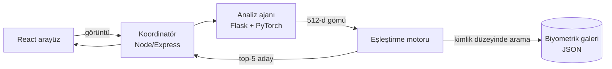

# TurtleVision

Deniz kaplumbağalarını yüzlerindeki pul deseninden (post-ocular scutes)
tanıyan, çok etmenli bir foto-ID sistemi. Markalama yapmadan, yalnızca
fotoğraftan birey tanıma.

Veri seti: [SeaTurtleID2022](https://www.kaggle.com/datasets/wildlifedatasets/seaturtleid2022)
— 8.729 fotoğraf, 438 birey, *Caretta caretta*.

---

## Bu projenin asıl bulgusu

Model eğitildikten sonra iki farklı şekilde değerlendirildi:

| Bölünme | top-1 | top-5 | mAP |
|---|---:|---:|---:|
| Rastgele bölünme | %71,28 | %79,90 | %31,36 |
| **Zamansal bölünme** | **%10,75** | %18,43 | %7,66 |

Aradaki uçurum bir ölçüm kazası değil, **modelin ne öğrendiğinin kanıtı.**

Rastgele bölünme aynı çekim gününün karelerini hem galeriye hem sorguya
sızdırıyor. Model o durumda bireyi tanımak zorunda değil; ışığı, su rengini,
arka planı, poz dizisini eşleştirerek de doğru cevap verebiliyor. Zamansal
bölünmede bu kestirme yol kapanıyor ve gerçek performans ortaya çıkıyor:
**%10,75.**

Aynı şey eğitim eğrisinde de görünüyordu — eğitim doğruluğu %94,5 iken
doğrulama top-1'i %16,8'de kalmıştı.

Sebep, modele tüm karenin verilmesi. Kafa kırpmalı bir ön deneme doğrulama
top-1'ini **4 epoch'ta %28**'e çıkardı; tam kare koşusu **30 epoch'ta
%16,8**'de kaldı. Sonraki adım bu yüzden kafa dedektörü (veri setinde 8.526
kafa maskesi var).

> Bu depoda `%71` sayısı öne çıkarılmıyor. Sahada geçerli olan sayı `%10,75`.

---

## Yol boyunca bulunan hatalar

Üçü de **istisna fırlatmıyordu** — sistem çalışıyor görünüyordu. Her biri
ölçülerek bulundu:

| Hata | Belirti | Ölçüm |
|---|---|---|
| Eğitilmemiş rastgele katman | Ajan her yeniden başladığında gömüler değişiyordu | süreçler arası kosinüs **−0,1377** (olması gereken 1,0) |
| Çift ön işleme | Görüntü iki kez BGR→RGB çevriliyordu | aynı fotoğrafın galeri/sorgu kosinüsü **0,248** → düzeltme sonrası **1,000000** |
| Ayar uyuşmazlığı | Galeri ve sorgu farklı çıkarım ayarıyla üretilebiliyordu | TTA'lı/TTA'sız gömü arası kosinüs **0,965** |

Çift ön işlemenin düzeltilmesi canlı doğruluğu aynı gün %10 → %85, farklı
gün %2,5 → %32,5 seviyesine taşıdı.

**Alınan ders.** Depodaki `scripts/check_deterministic.py` birinci hatayı
hiç yakalayamazdı: aynı süreç içinde iki çağrıyı karşılaştırıyor ve o test
her zaman geçer. Gerçek testi
[`test_determinism.py`](image-analysis-agent/tests/test_determinism.py)
yapıyor — modeli **ayrı bir süreçte** kurup gömüyü karşılaştırıyor.

Üçüncü hata artık yapısal olarak engelleniyor: galeri üretilirken yanına
`kaggle_db.meta.json` yazılıyor (gömü boyutu, gövde, ön işleme profili,
flip-TTA, checkpoint SHA256) ve servis açılışta bunu doğruluyor. Uyuşmazlıkta
`/health` sessizce geçmek yerine **HTTP 503 + nedeni** döndürüyor.

---

## Şu anki durum

Galeri: 875 kayıt / 438 birey, 512 boyutlu gömü (ResNet18 + ArcFace).

| Senaryo | top-1 | top-5 |
|---|---:|---:|
| Aynı gün (iyimser) | %83,3 | %88,6 |
| **Farklı gün (gerçekçi)** | **%27,9** | **%38,7** |

"Farklı gün" sahadaki gerçek sorudur: sorgu, galeriyle aynı çekim seansından
değildir.

**Bilinen zayıflık:** eşik kalibre edilmemiş. Ölçümde sorguların %100'ü
"eşleşme bulundu" eşiğini geçti. Sebep, kosinüsün `[-1,1]`'den `[0,1]`'e
haritalanması — %60 eşiği aslında kosinüs ≥ 0,2 demek. Sistem şu an
"bilmiyorum" diyemiyor. Ayrıntılar: [`reid/README.md`](reid/README.md).

---

## Mimari



Eşleştirme **kare düzeyinde değil kimlik düzeyinde**: bir bireyin galerideki
tüm kareleri tek bir skora toplanır
(`w · en_iyi_kare + (1−w) · centroid`, `w = 0,5`). Böylece top-5 listesi aynı
bireyin tekrarlanan kareleriyle dolmaz, beş ayrı aday gösterir.

| Bileşen | Yığın |
|---|---|
| Arayüz | React 18, Vite, Tailwind |
| Koordinatör | Node.js, Express, Joi |
| Analiz ajanı | Python, Flask, PyTorch, OpenCV |
| Veri ajanı | Python, Flask, MySQL |
| re-ID hattı | PyTorch (ArcFace, BN-neck) |

---

## Kurulum

```bash
git clone https://github.com/taha-hub0/TurtleVision-MAS.git
cd TurtleVision-MAS

# 1) Eğitilmiş modeli indir (depoda tutulmuyor, Release'ten gelir)
python reid/fetch_model.py

# 2) Ortam dosyalarını hazırla
cp image-analysis-agent/.env.example image-analysis-agent/.env
cp backend/.env.example              backend/.env
cp database-agent/.env.example       database-agent/.env
#    -> içindeki `degistirin` alanlarını doldurun

# 3) Bağımlılıklar
cd backend && npm install && cd ..
pip install -r image-analysis-agent/requirements.txt

# 4) Analiz ajanını başlat
cd image-analysis-agent && python app.py
```

Sağlık kontrolü:

```bash
curl http://localhost:5000/health
```

`"status": "healthy"` görmelisiniz. `degraded` + HTTP 503 alıyorsanız
`issue` alanı nedenini ve çözümünü yazar.

Testler:

```bash
cd backend            && npm test                      # 19 test
cd image-analysis-agent && python tests/test_matching.py     # 18 test
cd image-analysis-agent && python tests/test_determinism.py  # 10 test
```

---

## Depo düzeni

```
backend/              Koordinatör ajanı (Node/Express)
image-analysis-agent/ Gömü çıkarımı + eşleştirme (Flask/PyTorch)
database-agent/       Kalıcılık ajanı (Flask/MySQL)
frontend/             React arayüz
reid/                 Eğitim ve değerlendirme hattı
scripts/              Başlatma ve yardımcı betikler
docs/                 Ayrıntılı belgeler
```

- [`reid/README.md`](reid/README.md) — eğitim hattı, ölçüm yöntemi, bilinen sınırlar
- [`docs/MIMARI_VE_KOD_KALITESI.md`](docs/MIMARI_VE_KOD_KALITESI.md) — SOLID, temiz kod, sessiz başarısızlık üzerine
- [`docs/QUICKSTART.md`](docs/QUICKSTART.md) — hızlı başlangıç
- [`docs/architecture.md`](docs/architecture.md) — sistem mimarisi
- [`docs/api-spec.md`](docs/api-spec.md) — API sözleşmesi

---

## Sonraki adımlar

1. **Kafa dedektörü** — en büyük kazanç burada. Veri setinin 8.526 kafa maskesi bir dedektör eğitmeye yeter.
2. **Eşik kalibrasyonu** — doğrulama kümesinden ROC, üç bölgeli karar: *eşleşti* / *operatör onayına düşür* / *yeni birey*.
3. **Sol/sağ profil ayrımı** — iki yanak farklı biyometrik yüzeyler; tek kimlik altında eşleştirmek modeli zorluyor.
4. **Operatör geri bildirimi** — "doğru/yanlış" işaretlemesi saha etiketli veri üretir, bir sonraki eğitimin yakıtıdır.

## Lisans

MIT
